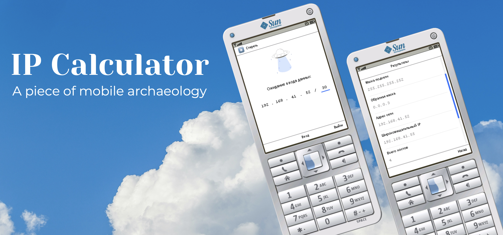

IP Calculator (J2ME)
==================

A simple J2ME application for calculating IPv4 network parameters.

The application was developed and tested on **Nokia 5220** and **Nokia E72**. 

The interface is Russian-only. On the Nokia E72, the MIDLet supports Russian and English keyboard layouts, as well as numeric mode.

## Features

* Enter an IP address by octets
* Enter a subnet mask
* Clear input with the `*` key
* Calculate network parameters with the Fire button (center key)
* View the calculation results on a separate screen

The result screen includes the network address, broadcast address, first and last host addresses, number of usable hosts, subnet mask, wildcard mask, and network prefix.

## Requirements

* J2ME device supporting **MIDP 2.0 / CLDC 1.1**

## Install

1. Download the latest `.jar` from the [Releases](https://github.com/developer-kaczmarek/J2ME-IpCalculator/releases) page.
2. Transfer the `.jar` file to your J2ME device.
3. Install and run the application.

## Build from Source

This project uses the original J2ME development environment and may not be compatible with modern versions of NetBeans or Java.

### Required Environment
- NetBeans 6.1 with Mobility Pack
- Java SE 6

## Bugs / Questions / Suggestions

📧 [Write to me](mailto:developer.kaczmarek@gmail.com) — I will fix issues, answer questions, or add details when possible.

## License

This project is licensed under the **GPL-3.0 License** – see the [LICENSE](LICENSE) file for details.
